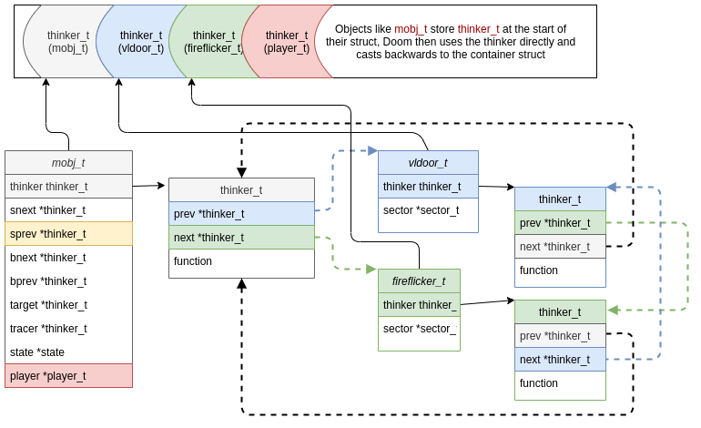
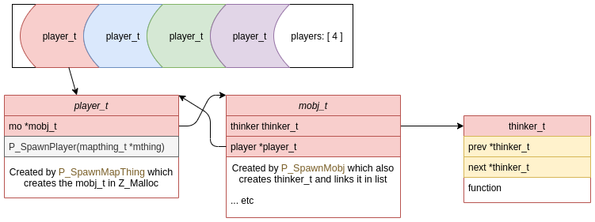

All objects that may interact, or change in any way are created with a `thinker_t` at their root. This is a struct that is essentially a linked list, but also contains a function pointer to run on the specific containing object:

```C
typedef struct thinker_s {
    struct thinker_s*	prev;
    struct thinker_s*	next;
    think_t		function;
    
} thinker_t;
```

Much of the reason for the linked list appears to be so that it is easy to add/remove items created using `Z_Malloc`, the Doom memory manager.



In the game tic loop the linked list is iterated over, and each thinker's function is called with itself as the arg. C casts the self as the containing object to match the function args. Hacky hacky! This is one source of frustration when trying to convert wholesale to Rust.

```C
typedef actionf_t  think_t;

typedef  void (*actionf_v)();
typedef  void (*actionf_p1)( void* );
typedef  void (*actionf_p2)( void*, void* );

typedef union {
  actionf_v	acv;
  actionf_p1	acp1;
  actionf_p2	acp2;

} actionf_t;
```

Some of the containers are simple enough, such as:

```C
typedef struct {
    thinker_t thinker;
    sector_t *sector;
    // other members removed for clarity
} vldoor_t;
```

```C
typedef struct {
    thinker_t thinker;
    sector_t *sector;
    // other members removed for clarity

} fireflicker_t;
```

These have pointers to the sectors they affect, and the thinker function is relatively straightforward with a single function per object type out of a possible:

- ceiling_t
- vldoor_t
- floormove_t
- plat_t
- fireflicker_t
- lightflash_t
- strobe_t
- glow_t

It would be simple enough to either combine these in one, or have separate containers per type - though thinkers would have to be run for each.


### mobj_t

This is the problem struct, as it has pointers in to many places.

```C
typedef struct mobj_s {
    // List: thinker links.
    thinker_t thinker;
    // More list: links in sector (if needed)
    struct mobj_s *snext;
    struct mobj_s *sprev;
    // Interaction info, by BLOCKMAP.
    struct mobj_s *bnext;
    struct mobj_s *bprev;

    struct subsector_s *subsector;

    // Static array of data to determine mob type
    mobjinfo_t *info; // &mobjinfo[mobj->type]

    // Static array of predefined states
    state_t *state;
    
    struct mobj_s *target;
    struct mobj_s *tracer;

    // Additional info record for player avatars only.
    // Only valid if type == MT_PLAYER
    struct player_s *player;
    // other members removed for clarity
} mobj_t;
```

These pointers may or may not be null. In the case of a `mobj_t` belonging to a player the player pointer is the address in memory of the player in a static array.

When a pointer is active, what it points to *must* live as long as the pointee. There is no way to define a max depth either so it is easy to create a pointer cycle.

Two pointers that are easy to deal with are `*info` and `*state` as these address a location in a static array only. `info` is used to build the object type. `state` contains another function pointer which is used within the thinker function (if it's a player/sprite/light).

```C
typedef struct {
    spritenum_t sprite;
    int frame;
    int tics;
    // void (*action) ();
    actionf_t action;
    statenum_t nextstate;
    int misc1;
    int misc2;
} state_t;
```

**Call tree of state function**

- `P_MobjThinker(mobj_t *mobj)`
  + -> may remove thinker/object from list and mark memory as purgable
  + -> `P_SetMobjState(mobj, mobj->state->nextstate)`
    - -> `st->action.acp1(mobj)`

Here a possible `acp1` funtion pointer might be:

```C
void A_VileTarget(mobj_t *actor) {
    mobj_t *fog;

    if (!actor->target)
        return;

    A_FaceTarget(actor);

    fog = P_SpawnMobj(actor->target->x,
                      actor->target->x,
                      actor->target->z, MT_FIRE);

    actor->tracer = fog;
    fog->target = actor;
    fog->tracer = actor->target;
    A_Fire(fog);
}
```

you can see the pointers being followed here. This function also spawns `MT_FIRE` with `P_SpawnMobj()`. This means that another `mobj_t/thinker_t` will be `Z_Malloc`ed and inserted in the linked list. It then calls `A_Fire(fog)` with that new object.

Can you see how it becomes difficult to prove data lifetimes, let alone getting mutability correct?

### Player

Lastly, the player is a special case. Made up of 3 different structs and haveing a cyclic pointer link between player and mobj:

